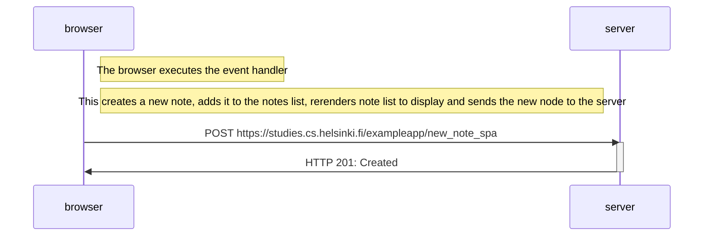

```mermaid
sequenceDiagram
    participant browser
    participant server

    Note right of browser: The browser executes the event handler 
    Note right of browser: This creates a new note, adds it to the notes list, rerenders note list to display and sends the new node to the server
    
    browser->>server: POST https://studies.cs.helsinki.fi/exampleapp/new_note_spa
    activate server
    server->>browser: HTTP 201: Created
    deactivate server
```